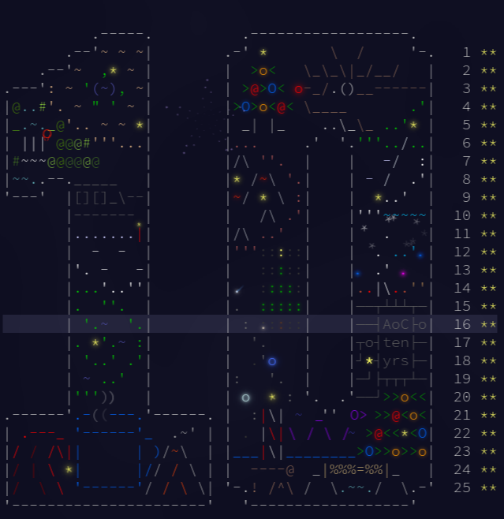

# Advent of Code 2024 - Progress Report

- **Language:** Go 1.24
- **Days Completed:** 1-25

## Algorithm Implementations & Learning

### Day 1: Historian Hysteria

- *Algorithm:** Sorting + Linear Search
- *Data Structures:** Slices, Maps
- *Key Learning:** Go's `sort.Ints()` and frequency counting patterns
- *Time Complexity:** O(n log n)

### Day 2: Red-Nosed Reports

- *Algorithm:** Brute Force with Single Element Removal
- *Data Structures:** Slices
- *Key Learning:** Problem Dampener - testing all single-element removals
- *Time Complexity:** O(n²) for dampened version, O(n) for basic validation

### Day 3: Mull It Over

- *Algorithm:** Regular Expression Parsing
- *Data Structures:** Regex captures
- *Key Learning:** Go's `regexp` package for pattern extraction
- *Time Complexity:** O(n)

### Day 4: Ceres Search

- *Algorithm:** 2D Grid Search + Direction Vectors
- *Data Structures:** 2D byte slices
- *Key Learning:** Multi-directional pattern matching in grids
- *Time Complexity:** O(n*m*8\*k) where k is pattern length

### Day 5: Print Queue

- *Algorithm:** Topological Sort + Dependency Validation
- *Data Structures:** Adjacency lists, Maps
- *Key Learning:** Cycle detection and ordering constraints
- *Time Complexity:** O(V + E)

### Day 6: Guard Gallivant

- *Algorithm:** Path Simulation + Cycle Detection
- *Data Structures:** 2D grids, Set for visited states
- *Key Learning:** State tracking with position+direction tuples
- *Time Complexity:** O(n*m*4)

### Day 7: Bridge Repair

- *Algorithm:** Iterative Enumeration + Base Conversion
- *Data Structures:** Slices, bit manipulation
- *Key Learning:** Binary/ternary enumeration for operator combinations
- *Time Complexity:** O(2^n) for part 1, O(3^n) for part 2

### Day 8: Resonant Collinearity

- *Algorithm:** Coordinate Geometry + Antinode Calculation
- *Data Structures:** Maps for frequency grouping
- *Key Learning:** Mathematical relationships between points and line extensions
- *Time Complexity:** O(n²)

### Day 9: Disk Fragmenter

- *Algorithm:** Iterative Search + Block Movement
- *Data Structures:** Dynamic arrays, file mapping
- *Key Learning:** Memory defragmentation with whole-file movement constraints
- *Time Complexity:** O(n²) for part 1, O(n²-n³) for part 2

### Day 10: Hoof It

- *Algorithm:** DFS for Path Finding + Trail Validation
- *Data Structures:** Recursion stack, visited sets
- *Key Learning:** Multi-source pathfinding on elevation constraints
- *Time Complexity:** O(V + E)

### Day 11: Plutonian Pebbles

- *Algorithm:** Dynamic Programming + Memoization
- *Data Structures:** Nested maps for caching (`map[string]map[int]*big.Int`)
- *Key Learning:** Exponential growth optimization through recursive memoization with arbitrary precision arithmetic
- *Time Complexity:** O(n\*k) with memoization vs O(2^n) naive
- *Implementation Notes:** Uses `math/big` for overflow protection, two-level memoization cache

### Day 12: Garden Groups

- *Algorithm:** Connected Components + Boundary Analysis
- *Data Structures:** BFS traversal, region sets
- *Key Learning:** Dual approaches for side counting - segment merging and corner detection
- *Time Complexity:** O(n\*m)
- *Implementation Notes:**

- Part 1: Perimeter calculation during BFS
- Part 2: Corner counting using convex/concave analysis (corners = sides principle)

### Day 13: Claw Contraption

- *Algorithm:** Linear Algebra + Gaussian Elimination
- *Data Structures:** Coefficient variables for 2x2 systems
- *Key Learning:** Integer solution validation with elimination method for constraint satisfaction
- *Time Complexity:** O(1) per system
- *Implementation Notes:** Uses elimination method equivalent to Cramer's rule, handles large coordinate offsets (10^13)

### Day 14: Claw Contraption

- *Algorithm:** Linear Algebra + Gaussian Elimination
- *Data Structures:** Coefficient variables for 2x2 systems
- *Key Learning:** Integer solution validation with elimination method for constraint satisfaction
- *Time Complexity:** O(1) per system
- *Implementation Notes:** Uses elimination method equivalent to Cramer's rule, handles large coordinate offsets (10^13)

### Day 15: Warehouse Wanderer

- *Algorithm:** Grid Simulation + Component Movement
- *Data Structures:** 2D grids, Sets (maps) for connected box tracking
- *Key Learning:** Simulating complex movement rules on a dynamic grid; chain pushing of connected components; transforming - roblem representations (normal vs. wide warehouse)
- *Time Complexity:** O(n \* m \* k) where n,m = grid dimensions, k = number of moves
- *Implementation Notes:**
-
- Part 1: Simulates robot movement and box pushing in a standard grid.
- Part 2: Transforms grid to "wide" representation with multi-cell boxes and pushes entire components vertically/horizontally.
- Uses BFS-like traversal to collect movable box groups.

### Day 16: Reindeer Maze

- Algorithm: Dijkstra's Algorithm (Forward + Backward) + State Space Search
- Data Structures: Priority Queue (min-heap), 3D state tracking (x, y, direction)
- Key Learning: Bidirectional pathfinding for optimal path counting, state includes orientation for turn costs
- Time Complexity: O(V log V) where V = cells × 4 directions
- Implementation Notes: Forward dijkstra finds minimum cost backward dijkstra from end calculates reverse distances, optimal tiles identified where forward_cost + backward_cost = minimum_total

### Day 17: Chronospatial Computer

(I will be honest here. I couldn't solve the part 2 on my own. Watched tons of
video and claude to solved this part 2)

- Algorithm: 3-bit Computer Simulation + Reverse Engineering (Backtracking)
- Data Structures: Virtual Machine State (registers A,B,C + instruction pointer), Candidate Queue
- Key Learning: Quine generation through base-8 digit reconstruction, working backwards from target output
- Time Complexity: O(8^n) where n = program length, but pruned heavily by early validation
- Implementation Notes: Forward simulation executes 8 opcodes with combo/literal operands, reverse search builds register A by testing 3-bit chunks from program end to start, each iteration shifts left 3 bits and tests 8 possibilities (0-7)

### Day 18: RAM Run

I solved this one step by step - Part 1 was straightforward pathfinding, but Part 2 required optimizing the search strategy to avoid checking every single byte position.

- Algorithm: BFS Pathfinding + Binary Search Optimization
Data Structures: Grid representation via corruption map (hash set), BFS queue with state tracking
- Key Learning: Binary search transforms O(n²) sequential checking into O(n log n), critical for large datasets where naive approaches timeout
- Time Complexity: O(n log n × grid_size) where n = number of falling bytes, each binary search iteration runs BFS in O(grid_size)
- Implementation Notes: BFS explores 4-directional movement with boundary/corruption checking, binary search bisects the byte sequence to find the exact transition point from "path exists" to "path blocked", corruption tracking uses hash map for O(1) lookup of blocked coordinates

### Day 19: Linen Layout

- Algorithm: Dynamic Programming + Memoization (Pattern Matching)
- Data Structures: Recursive cache (`map[string]int`), string slicing
- Key Learning: Prefix matching with memoized recursion for counting all possible ways to construct target strings
- Time Complexity: O(n*m*k) where n = design length, m = pattern count, k = average pattern length, with memoization
- Implementation Notes: Uses `strings.HasPrefix()` for pattern matching, memoization prevents recomputation of subproblems, counts both existence and total ways

### Day 20: Race Condition

- Algorithm: BFS Distance Calculation + Manhattan Distance Cheating
- Data Structures: Distance maps, coordinate pairs, BFS queue
- Key Learning: Cheat detection through Manhattan distance constraints between any two points on the optimal path
- Time Complexity: O(n*m + p²) where n,m = grid dimensions, p = path length
- Implementation Notes: Pre-calculates distances from start to all reachable points, evaluates all pairs of path points within cheat distance limit, filters cheats by minimum time savings

### Day 21: Keypad Conundrum

- Algorithm: Multi-Level Pathfinding + Memoized Dynamic Programming
- Data Structures: Keypad coordinate maps, BFS for shortest paths, nested memoization cache
- Key Learning: Hierarchical robot control with exponential complexity reduction through memoization across depth levels
- Time Complexity: O(k^d) without memoization vs O(k*d*s) with memoization, where k = keypad size, d = depth, s = sequence length
- Implementation Notes: Separates numeric and directional keypads, finds all shortest paths between key pairs, uses depth-based memoization for recursive robot chain simulation

### Day 22: Monkey Market

- Algorithm: Pseudo-Random Number Generation + Sequence Pattern Matching
- Data Structures: Maps for sequence tracking, arrays for price/change sequences
- Key Learning: PRNG with specific operations (XOR mixing, modulo pruning), optimal sequence finding across multiple buyers
- Time Complexity: O(n*m) where n = buyers, m = sequence length (2000)
- Implementation Notes: Uses mix() and prune() operations for secret generation, tracks 4-element change sequences for maximum banana collection, first occurrence optimization prevents double-counting sequences per buyer

### Day 23: LAN Party

- Algorithm: Graph Theory - Triangle Detection + Maximum Clique (Bron-Kerbosch)
- Data Structures: Adjacency list representation, set operations for clique detection
- Key Learning: Bron-Kerbosch algorithm with pivoting for efficient maximum clique finding in undirected graphs
- Time Complexity: O(n³) for triangle enumeration, O(3^(n/3)) for maximum clique with good pivoting
- Implementation Notes: Part 1 uses brute force triangle detection with 't' prefix filtering, Part 2 implements Bron-Kerbosch with pivot selection to minimize branching factor

### Day 24: Crossed Wires

- Algorithm: Logic Circuit Simulation + Structural Analysis with Greedy Swap Detection
- Data Structures: Gate representation, wire value maps, circuit verification functions
- Key Learning: Binary adder verification through structural pattern matching and progressive improvement via beneficial swaps
- Time Complexity: O(g) for simulation, O(g²*n) for swap detection where g = gates, n = swap rounds
- Implementation Notes: Simulates boolean logic gates (AND, OR, XOR), verifies full-adder structure through recursive pattern validation, uses greedy hill-climbing to find beneficial wire swaps

### Day 25: Code Chronicle

- Algorithm: Pattern Recognition + Combinatorial Matching
- Data Structures: Height arrays for lock/key representation, schematic parsing
- Key Learning: Transform 2D lock/key schematics into 1D height profiles for efficient overlap detection
- Time Complexity: O(n*m) where n = locks, m = keys
- Implementation Notes: Distinguishes locks (top filled, bottom empty) from keys (top empty, bottom filled), converts schematics to column heights, validates non-overlapping constraint through height summation

---
